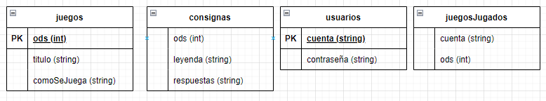

# G14-TPI-1CUAT
## Presupuesto
[Presupuesto](archivos/presupuesto.md)

## Interfaz de usuario
### HojaDeEstilo
[Hoja de estilo](archivos/hojaDeEstilo.md)\
[Wireframe](archivos/wireFrame.md)

## Consignas
[Crucigrama](archivos/crucigrama.md)\
[Sopa de letras](archivos/sopaDeLetras.md)\
[Verdadero o Falso](archivos/verdaderoFalso.md) \
[Ahorcado](archivos/ahorcado.md)

## Base de Datos
### DER

## Aplicacion en flask
[archivos](https://replit.com/join/vipcilbmwb-fede-a-5i)\
[aplicacion](https://odsgames.pythonanywhere.com/)
